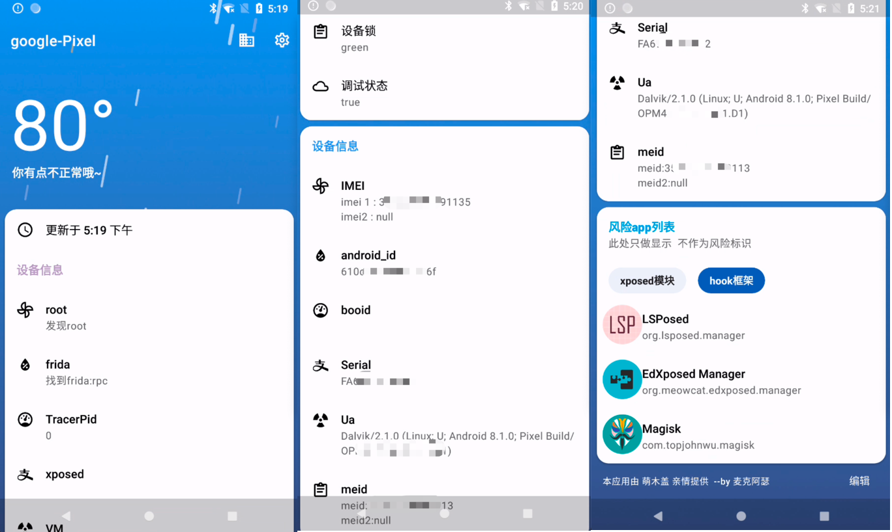

# PhoneCT

---

做一个美观的设备识别软件

- 设备指纹识别
- frida框架检测
- xposed框架检测
- root状态识别
- 等各种状态识别

# 初步形态
)

# 项目参考
[外观参考](https://github.com/WangDaYeeeeee/GeometricWeather)

[信息参考](https://github.com/song-dev/device-info)

[xposed检测参考](https://github.com/TUGOhost/anti_Android)

frida 检测参考

[frida:rpc ](https://github.com/xxr0ss/AntiFrida/blob/main/app/src/main/cpp/antifrida.cpp)

[D-bus 检测](https://github.com/muellerberndt/frida-detection)

[部分参考(珍惜)](https://bbs.kanxue.com/thread-277402.htm#msg_header_h3_9)

# 未完成参考
